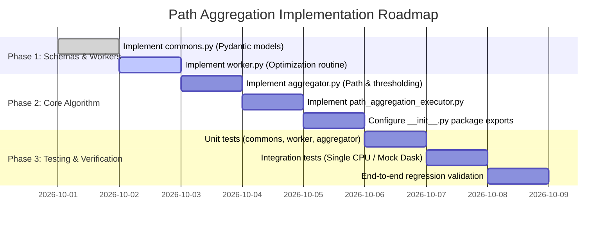

# Implementation Plan: `path_aggregation_executor`

This document outlines the architecture, design specifications, and phased implementation plan for the **`path_aggregation`** variable selection algorithm.

The implementation will be located at:
```
/root/mmd-two-sample-test-variable-selection/mmd_tst_variable_detector/detection_algorithm/path_aggregation_executor
```

---

## 1. Architectural Overview & Design Objectives

### 1.1 Core Goals
1. **Inherit from `BaseVariableDetector`**: The primary executor class must implement the interface contract defined in [`BaseVariableDetector`](file:///root/mmd-two-sample-test-variable-selection/mmd_tst_variable_detector/detection_algorithm/base.py#L11-L69) (`run_detection`).
2. **Unified Task Dispatcher Integration**: Seamlessly interface with [`create_task_dispatcher`](file:///root/mmd-two-sample-test-variable-selection/mmd_tst_variable_detector/accelerator_optimizations/factory.py#L13-L98) to support Single CPU, Single GPU, Dask CPU, and Concurrent GPU (NVIDIA MPS multi-slot) execution modes.
3. **Concurrent Execution of the Regularization Path**: In [`document.md`](file:///root/mmd-two-sample-test-variable-selection/documents/path_aggregation/document.md#L172-L182) (lines 172–182), the loop optimizing $\hat{a}_\lambda$ across the grid $\Lambda = \{\lambda_1, \dots, \lambda_L\}$ (and across subsample splits $b = 1, \dots, B$) is parallelized by generating task request payloads and dispatching them through the task dispatcher when $> 1$ concurrent execution slots are available.
4. **Pydantic Data Models**: All structured parameters, request payloads, task returns, and detection results use Pydantic `BaseModel` schemas following repository coding guidelines.
5. **Coding Guidelines Adherence**: Strict adherence to naming conventions (`verb-noun-adjectives` for functions/variables, `Adjective Noun` or `-er, -or` suffix for classes), type hinting (`import typing as ty`), and explicit `# end <block>` comment markers.

---

## 2. Module Directory Structure

The package `path_aggregation_executor` will be organized as follows:

```
mmd_tst_variable_detector/detection_algorithm/path_aggregation_executor/
├── __init__.py                     # Package entry point, exposing executor and models
├── commons.py                      # Pydantic schemas (parameters, request payloads, results)
├── worker.py                       # Serializable worker function for MMD regularized optimization
├── aggregator.py                   # Path aggregation math (rho transformations, score accumulation, thresholding)
└── path_aggregation_executor.py    # Main executor inheriting BaseVariableDetector
```

### Component Responsibilities

| File | Primary Responsibility | Key Classes / Functions |
| :--- | :--- | :--- |
| `commons.py` | Data structures & schemas for configs, payloads, and results | `PathAggregationAlgorithmParameter`, `PathAggregationTaskRequest`, `PathAggregationTaskResult`, `PathAggregationDetectionResult` |
| `worker.py` | Standalone serializable routine for optimizing one regularized MMD problem | `worker_path_aggregation_optimization_routine` |
| `aggregator.py` | Aggregates weights along $\Lambda$ and applies threshold $\tau$ | `PathAggregator`, `transform_score_identity`, `transform_score_bounded` |
| `path_aggregation_executor.py` | Coordinates task generation, dispatching, and aggregation | `PathAggregationVariableDetector` (alias: `PathAggregationExecutor`) |
| `__init__.py` | Public API surface | Exports detector, parameters, and results |

---

## 3. Data Models and Schemas (`commons.py`)

Per the repository's Python guidelines, multi-value returns and structured parameters are defined using Pydantic `BaseModel` or dataclasses.

```python
import typing as ty
import torch
from pydantic import BaseModel, Field


class PathAggregationAlgorithmParameter(BaseModel):
    """Configuration parameters for the path_aggregation algorithm."""
    regularization_grid: ty.List[float] = Field(
        ...,
        description="Grid of L1 regularization parameters lambda in ascending order."
    )
    threshold: float = Field(
        default=0.01,
        gt=0.0,
        description="Selection threshold tau > 0 for aggregated importance scores."
    )
    weight_transformation: ty.Literal["identity", "bounded"] = Field(
        default="identity",
        description="Transformation function rho(t): 'identity' (t) or 'bounded' (t / (1+t))."
    )
    path_weights: ty.Optional[ty.List[float]] = Field(
        default=None,
        description="Non-negative path weights w_lambda summing to 1.0. Defaults to uniform weights."
    )
    subsampling_splits: int = Field(
        default=1,
        ge=1,
        description="Number of subsampling splits B. If 1, operates on the full dataset without splitting."
    )
    subsampling_ratio: float = Field(
        default=0.8,
        gt=0.0,
        le=1.0,
        description="Data fraction to retain per subsample split when subsampling_splits > 1."
    )
    random_seed: ty.Optional[int] = Field(
        default=42,
        description="Random seed for reproducible subsampling."
    )
# end class


class PathAggregationTaskRequest(BaseModel):
    """Payload representing an individual regularized optimization task along the path."""
    task_id: str = Field(description="Unique task identifier, e.g., 'lambda_0.010000-split_0'.")
    lambda_val: float = Field(description="L1 regularization parameter lambda.")
    split_index: int = Field(default=0, description="Subsample split index b (0 if no subsampling).")
    
    # Non-Pydantic objects configured with arbitrary_types_allowed
    class Config:
        arbitrary_types_allowed = True
    # end class
    
    estimator: ty.Any = Field(description="Instance of BaseMmdEstimator with ARD product kernel.")
    dataset_train: ty.Any = Field(description="Training dataset containing sample groups X and Y.")
    dataset_validation: ty.Optional[ty.Any] = Field(
        default=None,
        description="Optional validation dataset (defaults to dataset_train if None)."
    )
    training_parameter: ty.Any = Field(description="InterpretableMmdTrainParameters for the learner.")
    pytorch_trainer_config: ty.Any = Field(description="PytorchLightningDefaultArguments configuration.")
# end class


class PathAggregationTaskResult(BaseModel):
    """Result of an individual regularized optimization task."""
    task_id: str = Field(description="Unique task identifier.")
    lambda_val: float = Field(description="L1 regularization parameter lambda used.")
    split_index: int = Field(description="Split index b.")
    is_success: bool = Field(description="Whether optimization converged without non-recoverable error.")
    trained_ard_weights: ty.List[float] = Field(description="Optimized ARD weight vector a_lambda as a float list.")
    loss_final: float = Field(description="Final training loss value.")
    execution_time_seconds: float = Field(description="Wall-clock execution duration in seconds.")
# end class


class PathAggregationDetectionResult(BaseModel):
    """Final output container for the path_aggregation algorithm."""
    selected_variables: ty.List[int] = Field(
        description="0-indexed list of variable indices identified where Pi_hat_j > tau."
    )
    aggregated_scores: ty.List[float] = Field(
        description="Length-d vector of aggregated variable importance scores Pi_hat_j."
    )
    regularization_path_weights: ty.List[ty.List[float]] = Field(
        description="Matrix of shape (L, d) containing optimized weights along the regularization path."
    )
    regularization_grid: ty.List[float] = Field(
        description="The regularization grid Lambda = {lambda_1, ..., lambda_L} evaluated."
    )
    execution_metadata: ty.Dict[str, ty.Any] = Field(
        default_factory=dict,
        description="Diagnostic statistics (execution time, convergence flags, task results)."
    )
# end class
```

---

## 4. Concurrency & Dispatcher Integration

### 4.1 Dispatcher Construction
The executor instantiates its task dispatcher via [`create_task_dispatcher`](file:///root/mmd-two-sample-test-variable-selection/mmd_tst_variable_detector/accelerator_optimizations/factory.py#L13-L98). All relevant parameters are captured in `PathAggregationVariableDetector.__init__`:

- `train_accelerator: str = "cpu"`: Target accelerator (`"cpu"`, `"gpu"`, `"cuda"`, or `"auto"`).
- `distributed_mode: str = "single"`: Execution mode (`"single"` or `"dask"`).
- `dask_client: ty.Optional[Client] = None`: Active Dask client if cluster execution is selected.
- `dask_scheduler_address: ty.Optional[str] = None`: Scheduler address if connecting externally.
- `distributed_batch_size: int = 1`: Task chunk size processed per dispatcher batch.
- `device_id: int = 0`: GPU device index for single-GPU execution.
- `resume_checkpoint_saver: ty.Optional[ty.Any] = None`: Checkpoint saver for intermediate task results.
- `post_process_handler: ty.Optional[PostProcessLoggerHandler] = None`: Metrics logging and visualization handler.
- `cv_experiment_name: ty.Optional[str] = None`: Unique experiment name for logging.
- `worker_fn: ty.Optional[ty.Callable] = None`: Custom worker routine; defaults to `worker_path_aggregation_optimization_routine`.

### 4.2 Concurrency Mapping (Replacing Lines 172–182 in `document.md`)

In the baseline pseudocode from [`document.md`](file:///root/mmd-two-sample-test-variable-selection/documents/path_aggregation/document.md#L172-L182):
```python
# Sequential baseline (from document.md)
for lambda_val in lambda_grid:
    a_hat_lambda = optimize_regularized_mmd(X=X, Y=Y, estimator=estimator, regularization_weight=lambda_val)
    path_weights_matrix.append(a_hat_lambda)
# end for
```

Under `path_aggregation_executor`, the task payloads are materialized into a flat sequence and dispatched concurrently:

```python
# Concurrency mechanism in path_aggregation_executor
seq_task_requests = self._generate_task_requests(
    training_dataset=training_dataset,
    validation_dataset=validation_dataset,
    lambda_grid=self.algorithm_parameters.regularization_grid,
    subsampling_splits=self.algorithm_parameters.subsampling_splits,
    subsampling_ratio=self.algorithm_parameters.subsampling_ratio,
)

# Dispatch across CPU cores or concurrent GPU slots (MPS / Dask)
seq_task_results = self.task_dispatcher.dispatch(seq_task_requests)
```

#### Dispatcher Routing Table

| Hardware (`train_accelerator`) | Mode (`distributed_mode`) | Instantiated Dispatcher | Execution Behavior |
| :--- | :--- | :--- | :--- |
| `"cpu"` | `"single"` | `SingleCpuTaskDispatcher` | Sequential in local process |
| `"gpu"` / `"cuda"` | `"single"` | `SingleGpuTaskDispatcher` | Sequential on specified GPU device |
| `"cpu"` | `"dask"` | `DaskCpuTaskDispatcher` | **Concurrent** across CPU worker processes |
| `"gpu"` / `"cuda"` | `"dask"` | `ConcurrentGpuTaskDispatcher` | **Concurrent** multi-slot GPU execution via NVIDIA MPS |

---

## 5. Worker Optimization Routine (`worker.py`)

The worker routine executes an individual regularized MMD optimization problem. It is implemented as a top-level, stateless function to ensure clean Dask serialization across process boundaries.

```python
import time
import copy
import logging
import torch
import typing as ty

from ...detection_algorithm.commons import RegularizationParameter, InterpretableMmdTrainParameters
from ...detection_algorithm.pytorch_lightning_trainer import create_mmd_trainer, get_mmd_detector_class
from .commons import PathAggregationTaskRequest, PathAggregationTaskResult

logger = logging.getLogger(f"{__package__}.{__name__}")


def worker_path_aggregation_optimization_routine(
    request: PathAggregationTaskRequest
) -> PathAggregationTaskResult:
    """Execute single regularized test-power optimization task for a given lambda.

    Solves:
        max_{a >= 0} { log J_n(a) - lambda * ||a||_1 }
    """
    start_time = time.time()
    
    # 1. Deepcopy estimator and initialize ARD weights to ones
    estimator_copy = copy.deepcopy(request.estimator)
    initial_weights = torch.ones(estimator_copy.kernel_obj.ard_weights.shape)
    estimator_copy.kernel_obj.ard_weights = torch.nn.Parameter(initial_weights)

    # 2. Materialize in-memory datasets if file-backed
    train_dataset = request.dataset_train.generate_dataset_on_ram() if request.dataset_train.is_dataset_on_ram() else request.dataset_train
    val_dataset = request.dataset_validation if request.dataset_validation is not None else train_dataset
    if val_dataset.is_dataset_on_ram():
        val_dataset = val_dataset.generate_dataset_on_ram()
    # end if

    # 3. Configure training parameters with pure L1 penalty: (lambda_1 = lambda_val, lambda_2 = 0.0)
    train_params = copy.deepcopy(request.training_parameter)
    train_params.regularization_parameter = RegularizationParameter(
        lambda_1=request.lambda_val,
        lambda_2=0.0
    )
    train_params.is_use_log = 1  # log J_n(a)
    train_params.objective_function = "ratio"

    # 4. Instantiate detector module and trainer
    use_legacy = getattr(train_params, "use_legacy_optimization", False) or \
                 getattr(request.pytorch_trainer_config, "use_legacy_optimization", False)
    detector_cls = get_mmd_detector_class(use_legacy_optimization=use_legacy)
    detector_instance = detector_cls(
        mmd_estimator=estimator_copy,
        training_parameter=train_params,
        dataset_train=train_dataset,
        dataset_validation=val_dataset,
    )

    trainer = create_mmd_trainer(
        trainer_config=request.pytorch_trainer_config,
        trainer_backend=getattr(train_params, "trainer_backend", None),
        use_fused_kernel=getattr(train_params, "use_fused_kernel", None),
    )

    # 5. Fit model
    trainer.fit(model=detector_instance)
    
    # 6. Extract trained ARD weights and check convergence
    trained_vars = detector_instance.get_trained_variables()
    ard_weights_tensor = trained_vars.ard_weights_kernel_k.detach().cpu()
    
    # Ensure non-negativity: a >= 0
    ard_weights_clamped = torch.clamp(ard_weights_tensor, min=0.0).flatten().tolist()
    
    nan_ratio = trained_vars.training_stats.nan_ratio if trained_vars.training_stats else 0.0
    is_success = bool(nan_ratio is None or nan_ratio < 0.9)
    loss_final = float(trained_vars.trajectory_record_training[-1].loss) if trained_vars.trajectory_record_training else 0.0
    duration = time.time() - start_time

    return PathAggregationTaskResult(
        task_id=request.task_id,
        lambda_val=request.lambda_val,
        split_index=request.split_index,
        is_success=is_success,
        trained_ard_weights=ard_weights_clamped,
        loss_final=loss_final,
        execution_time_seconds=duration,
    )
# end def
```

---

## 6. Aggregation & Selection Logic (`aggregator.py`)

The aggregator handles mathematical score accumulation and variable selection:

```python
import typing as ty
import torch
from .commons import PathAggregationAlgorithmParameter, PathAggregationTaskResult


def transform_score_identity(tensor_val: torch.Tensor) -> torch.Tensor:
    """Identity transformation rho(t) = t."""
    return tensor_val
# end def


def transform_score_bounded(tensor_val: torch.Tensor) -> torch.Tensor:
    """Bounded transformation rho(t) = t / (1 + t)."""
    return tensor_val / (1.0 + tensor_val)
# end def


class PathAggregator:
    """Performs path aggregation over regularized solutions and applies thresholding."""

    def __init__(self, parameters: PathAggregationAlgorithmParameter) -> None:
        self.parameters = parameters
        if parameters.weight_transformation == "bounded":
            self.rho_fn = transform_score_bounded
        else:
            self.rho_fn = transform_score_identity
        # end if
    # end def

    def aggregate_path_weights(
        self,
        task_results: ty.List[PathAggregationTaskResult],
        dimension_size: int,
    ) -> ty.Tuple[ty.List[float], ty.List[ty.List[float]]]:
        """Aggregate weights across regularization path and subsample splits."""
        grid = self.parameters.regularization_grid
        L = len(grid)
        B = max(1, self.parameters.subsampling_splits)

        # Normalize path weights w_lambda
        if self.parameters.path_weights is not None:
            total_w = sum(self.parameters.path_weights)
            weights = [w / total_w for w in self.parameters.path_weights]
        else:
            weights = [1.0 / L] * L
        # end if

        # Organize results by (lambda_idx, split_idx)
        weights_by_lambda = {l_idx: [] for l_idx in range(L)}
        lambda_to_idx = {val: idx for idx, val in enumerate(grid)}

        for res in task_results:
            if not res.is_success:
                continue
            # end if
            l_idx = lambda_to_idx.get(res.lambda_val)
            if l_idx is not None:
                weights_by_lambda[l_idx].append(res.trained_ard_weights)
            # end if
        # end for

        # Average weights across splits for each lambda
        avg_path_weights: ty.List[ty.List[float]] = []
        for l_idx in range(L):
            split_records = weights_by_lambda[l_idx]
            if not split_records:
                avg_path_weights.append([0.0] * dimension_size)
            else:
                tensor_splits = torch.tensor(split_records, dtype=torch.float32)
                mean_w = torch.mean(tensor_splits, dim=0).tolist()
                avg_path_weights.append(mean_w)
            # end if
        # end for

        # Compute Pi_hat_j = sum_l w_l * rho(a_{l, j})
        scores_tensor = torch.zeros(dimension_size, dtype=torch.float32)
        for l_idx in range(L):
            w_l = weights[l_idx]
            a_l = torch.tensor(avg_path_weights[l_idx], dtype=torch.float32)
            scores_tensor += w_l * self.rho_fn(a_l)
        # end for

        return scores_tensor.tolist(), avg_path_weights
    # end def

    def select_variables(self, aggregated_scores: ty.List[float]) -> ty.List[int]:
        """Return 0-indexed variable indices where Pi_hat_j > tau."""
        tau = self.parameters.threshold
        selected = [j for j, score in enumerate(aggregated_scores) if score > tau]
        return selected
    # end def
# end class
```

---

## 7. Main Executor Class Design (`path_aggregation_executor.py`)

The executor inherits [`BaseVariableDetector`](file:///root/mmd-two-sample-test-variable-selection/mmd_tst_variable_detector/detection_algorithm/base.py#L11-L69) and orchestrates the end-to-end pipeline:

```python
class PathAggregationVariableDetector(BaseVariableDetector):
    """Variable detector implementing the path_aggregation algorithm.
    
    Inherits BaseVariableDetector and coordinates distributed execution via
    the BaseTaskDispatcher factory.
    """

    def __init__(
        self,
        estimator: BaseMmdEstimator,
        regularization_grid: ty.Sequence[float],
        pytorch_trainer_config: ty.Optional[PytorchLightningDefaultArguments] = None,
        base_training_parameter: ty.Optional[InterpretableMmdTrainParameters] = None,
        threshold: float = 0.01,
        weight_transformation: ty.Literal["identity", "bounded"] = "identity",
        path_weights: ty.Optional[ty.Sequence[float]] = None,
        subsampling_splits: int = 1,
        subsampling_ratio: float = 0.8,
        random_seed: ty.Optional[int] = 42,
        # Dispatcher / accelerator parameters
        train_accelerator: str = "cpu",
        distributed_mode: str = "single",
        dask_client: ty.Optional[Client] = None,
        dask_scheduler_address: ty.Optional[str] = None,
        distributed_batch_size: int = 1,
        device_id: int = 0,
        resume_checkpoint_saver: ty.Optional[ty.Any] = None,
        post_process_handler: ty.Optional[PostProcessLoggerHandler] = None,
        cv_experiment_name: ty.Optional[str] = None,
        worker_fn: ty.Optional[ty.Callable] = None,
        **kwargs: ty.Any,
    ) -> None:
        super().__init__(
            estimator=estimator,
            pytorch_trainer_config=pytorch_trainer_config if pytorch_trainer_config else PytorchLightningDefaultArguments(),
            post_process_handler=post_process_handler,
            dask_client=dask_client,
            **kwargs,
        )
        # 1. Algorithm parameters
        self.algorithm_parameters = PathAggregationAlgorithmParameter(
            regularization_grid=sorted(list(regularization_grid)),
            threshold=threshold,
            weight_transformation=weight_transformation,
            path_weights=list(path_weights) if path_weights is not None else None,
            subsampling_splits=subsampling_splits,
            subsampling_ratio=subsampling_ratio,
            random_seed=random_seed,
        )
        self.base_training_parameter = base_training_parameter if base_training_parameter is not None else InterpretableMmdTrainParameters()

        # 2. Dispatcher configurations
        self.train_accelerator = train_accelerator
        self.distributed_mode = distributed_mode
        self.dask_scheduler_address = dask_scheduler_address
        self.distributed_batch_size = distributed_batch_size
        self.device_id = device_id
        self.resume_checkpoint_saver = resume_checkpoint_saver
        self.cv_experiment_name = cv_experiment_name
        self.worker_fn = worker_fn if worker_fn is not None else worker_path_aggregation_optimization_routine

        # 3. Instantiate dispatcher via factory
        self.task_dispatcher = create_task_dispatcher(
            train_accelerator=self.train_accelerator,
            distributed_mode=self.distributed_mode,
            dask_client=self.dask_client,
            dask_scheduler_address=self.dask_scheduler_address,
            batch_size=self.distributed_batch_size,
            resume_checkpoint_saver=self.resume_checkpoint_saver,
            post_process_handler=self.post_process_handler,
            cv_experiment_name=self.cv_experiment_name,
            device_id=self.device_id,
            worker_fn=self.worker_fn,
            **kwargs,
        )
    # end def

    def run_detection(
        self,
        training_dataset: BaseDataset,
        validation_dataset: ty.Optional[BaseDataset] = None,
        **kwargs: ty.Any,
    ) -> PathAggregationDetectionResult:
        """Execute the path_aggregation detection workflow."""
        start_wall_time = time.time()
        dimension_size = self.estimator.kernel_obj.ard_weights.shape[0]

        # 1. Generate task request sequence for grid x splits
        seq_task_requests = self._generate_task_requests(
            training_dataset=training_dataset,
            validation_dataset=validation_dataset,
        )

        # 2. Dispatch tasks concurrently/sequentially
        seq_task_results: ty.List[PathAggregationTaskResult] = self.task_dispatcher.dispatch(seq_task_requests)

        # 3. Aggregate importance scores along regularization path
        aggregator = PathAggregator(parameters=self.algorithm_parameters)
        aggregated_scores, path_weights_matrix = aggregator.aggregate_path_weights(
            task_results=seq_task_results,
            dimension_size=dimension_size,
        )

        # 4. Final variable selection via thresholding
        selected_variables = aggregator.select_variables(aggregated_scores=aggregated_scores)

        total_duration = time.time() - start_wall_time
        metadata = {
            "execution_time_total_seconds": total_duration,
            "num_tasks_executed": len(seq_task_results),
            "num_successful_tasks": sum(1 for r in seq_task_results if r.is_success),
            "train_accelerator": self.train_accelerator,
            "distributed_mode": self.distributed_mode,
        }

        return PathAggregationDetectionResult(
            selected_variables=selected_variables,
            aggregated_scores=aggregated_scores,
            regularization_path_weights=path_weights_matrix,
            regularization_grid=self.algorithm_parameters.regularization_grid,
            execution_metadata=metadata,
        )
    # end def
```

---

## 8. Step-by-Step Implementation Roadmap



### Phase 1: Foundation & Data Modeling
1. Create directory `mmd_tst_variable_detector/detection_algorithm/path_aggregation_executor/`.
2. Implement `commons.py`:
   - Define `PathAggregationAlgorithmParameter`.
   - Define `PathAggregationTaskRequest`.
   - Define `PathAggregationTaskResult`.
   - Define `PathAggregationDetectionResult`.
3. Implement `worker.py`:
   - Standalone `worker_path_aggregation_optimization_routine` taking `PathAggregationTaskRequest` and returning `PathAggregationTaskResult`.
   - Ensure proper clamping ($a \ge 0$) and graceful error/NaN handling.

### Phase 2: Aggregator & Executor
1. Implement `aggregator.py`:
   - Identity ($\rho(t) = t$) and bounded ($\rho(t) = \frac{t}{1+t}$) score transformations.
   - Normalization and path score accumulation $\hat{\Pi}_j = \sum_{\lambda} w_\lambda \rho(\hat{a}_{\lambda, j})$.
   - Subsampling averaging if $B > 1$.
   - Feature thresholding $\hat{S} = \{j : \hat{\Pi}_j > \tau\}$.
2. Implement `path_aggregation_executor.py`:
   - Define `PathAggregationVariableDetector` inheriting `BaseVariableDetector`.
   - Connect `__init__` arguments to `create_task_dispatcher`.
   - Implement `_generate_task_requests` for grid $\Lambda$ and subsampling splits $B$.
   - Implement `run_detection` coordinating dispatch, aggregation, and result generation.
   - Provide backward-compatible alias: `PathAggregationExecutor = PathAggregationVariableDetector`.
3. Implement `__init__.py`:
   - Export `PathAggregationVariableDetector`, `PathAggregationExecutor`, and data schemas.

### Phase 3: Testing & Quality Assurance
1. Create `tests/test_path_aggregation_executor.py`:
   - **Unit Tests**:
     - Parameter validation in `commons.py`.
     - Output shape and score values in `aggregator.py` under identity and bounded $\rho$.
     - `worker.py` execution on a small synthetic Gaussian dataset.
   - **Integration Tests**:
     - Single CPU execution with small grid (e.g. $\Lambda = [0.01, 0.1, 1.0]$) on synthetic data with known ground-truth features.
     - Dask CPU execution using a local Dask `Client()`.
     - Subsampling mode verification ($B = 3$, subsample ratio $0.8$).
     - Edge cases: all scores below threshold ($\hat{S} = \emptyset$), strong signal features correctly detected.

---

## 9. Verifiable Success Criteria (Karpathy Guidelines)

| Milestone | Check / Verification Method | Target Status |
| :--- | :--- | :--- |
| **Pydantic Schemas** | Unit test verifying invalid inputs raise `ValidationError` | Passed |
| **Worker Function** | Single task execution returns valid weights and non-negative values | Passed |
| **Task Dispatching** | `dispatcher.dispatch(seq_tasks)` executes all $\Lambda$ tasks via `create_task_dispatcher` | Passed |
| **Deterministic Results** | Full-data path aggregation gives identical results given identical seed | Passed |
| **Signal Recovery** | Detects active dimensions on synthetic benchmark (e.g. 2 active dims out of 10) | $\hat{S} = \{0, 1\}$ |
| **Style & Formatting** | Code follows `# end <block>` comments and naming rules | Verified |
| **Test Suite** | `pytest tests/test_path_aggregation_executor.py` runs with zero failures | 100% Passed |
