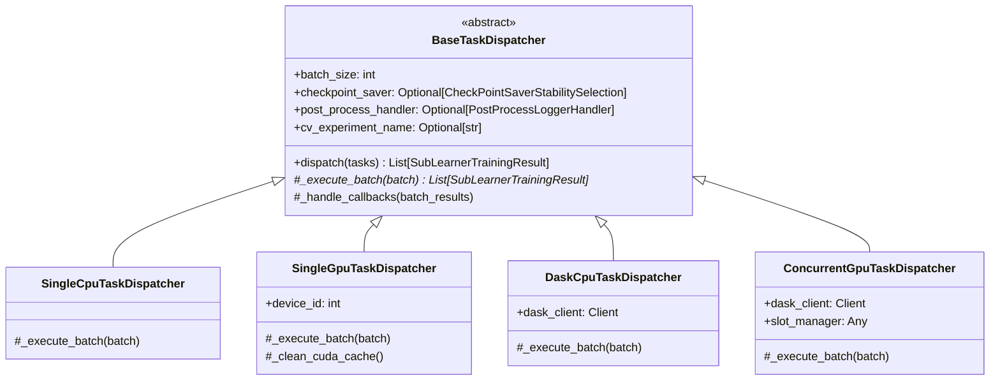

# Accelerator Optimizations & Task Dispatchers

This module coordinates task dispatching and GPU acceleration for MMD variable selection workloads across different execution targets.

## Architectural Design: Class-per-Type Polymorphism (Option B)

Tasks are dispatched through specialized dispatcher classes inheriting from a common base class `BaseTaskDispatcher`. A factory function `create_task_dispatcher` routes requests based on `train_accelerator` and `distributed_mode`.



---

## Dispatch Modes

| Mode | `train_accelerator` | `distributed_mode` | Dispatcher Class | Execution Characteristics |
| :--- | :--- | :--- | :--- | :--- |
| **1. Single CPU** | `'cpu'` | `'single'` | `SingleCpuTaskDispatcher` | Sequential in-process execution with stripped PyTorch Lightning overhead. |
| **2. Single GPU** | `'gpu'` / `'cuda'` | `'single'` | `SingleGpuTaskDispatcher` | Sequential execution on the target GPU; triggers `torch.cuda.empty_cache()` and `gc.collect()` after each run. Asserts hardware architecture compatibility. |
| **3. Dask CPU** | `'cpu'` | `'dask'` | `DaskCpuTaskDispatcher` | Distributed across CPU Dask workers via `dask_client.map` and `dask_client.gather`. |
| **4. Concurrent GPU** | `'gpu'` / `'cuda'` | `'dask'` | `ConcurrentGpuTaskDispatcher` | Multi-slot GPU concurrency via NVIDIA MPS, `DeviceSlotManager` worker pinning (`CUDA_VISIBLE_DEVICES`), dynamic VRAM estimation, and hardware compatibility checks. |

---

## Concurrent GPU Orchestration Submodules (`concurrent_gpu_modules/`)

Modules specific to concurrent multi-slot GPU execution are organized under `mmd_tst_variable_detector/accelerator_optimizations/concurrent_gpu_modules/`:

| Module | Class / Function | Purpose |
| :--- | :--- | :--- |
| `gpu_environment_manager.py` | `assert_device_compatibility` | Compares device compute capability (e.g. `sm_61`) with PyTorch build capabilities (`torch.cuda.get_arch_list()`). Halts immediately with `IncompatibleGpuArchitectureError` if an architecture gap exists. |
| `gpu_environment_manager.py` | `GpuEnvironmentManager` | Manages NVIDIA MPS daemon start/stop lifecycle with graceful fallback to standard CUDA time-slicing when MPS is unavailable or restricted. |
| `vram_estimator.py` | `VramConsumptionEstimator` | Queries free VRAM via `torch.cuda.mem_get_info` and estimates peak memory per task to compute optimal concurrent slots $K = \lfloor (\text{VRAM}_{\text{free}} \times \text{SafetyMargin}) / \text{VRAM}_{\text{peak}} \rfloor$. |
| `device_slot_manager.py` | `DeviceSlotManager` | Spawns a Dask `SpecCluster` with dedicated Nanny worker subprocesses pinned to specific GPUs via `CUDA_VISIBLE_DEVICES`. |
| `exceptions.py` | `IncompatibleGpuArchitectureError` | Custom exception halting execution when GPU hardware architecture is unsupported by the installed PyTorch installation. |

---

## Factory Interface

Callers instantiate dispatchers using `create_task_dispatcher`:

```python
from mmd_tst_variable_detector.accelerator_optimizations import create_task_dispatcher

dispatcher = create_task_dispatcher(
    train_accelerator="gpu",
    distributed_mode="single",
    batch_size=1,
    resume_checkpoint_saver=checkpoint_saver,
    post_process_handler=post_process_handler,
    cv_experiment_name=cv_experiment_name,
)

results = dispatcher.dispatch(seq_task_arguments)
```

---

## Shared Base Responsibilities (`BaseTaskDispatcher`)
1. **Batching**: Slices `seq_task_arguments` by `batch_size`.
2. **Template Method (`dispatch`)**:
   - Calls abstract `_execute_batch(batch)`.
   - Invokes `resume_checkpoint_saver.save_checkpoint()` for completed jobs.
   - Triggers `post_process_handler.log()` per batch.
3. **Subclass Extension**: Each subclass overrides only `_execute_batch(batch)`.

---

## Caller Integration Pattern

Algorithm controllers (such as `SubModuleCrossValidationFixedRange` in `cross_validation_detector`) use a single unified dispatch method instead of hardcoding a method per backend:

```python
def _dispatch_tasks(self, seq_task_arguments):
    accelerator = getattr(self.pytorch_trainer_config, "accelerator", "cpu")
    dispatcher = create_task_dispatcher(
        train_accelerator=accelerator if isinstance(accelerator, str) else "cpu",
        distributed_mode=self.training_parameter.computation_backend,
        dask_scheduler_address=getattr(self.training_parameter.distributed_parameter, "dask_scheduler_address", None),
        batch_size=self.training_parameter.distributed_parameter.job_batch_size,
        resume_checkpoint_saver=self.resume_checkpoint_saver,
        post_process_handler=self.post_process_handler,
        cv_experiment_name=self.cv_detection_experiment_name,
    )
    return dispatcher.dispatch(seq_task_arguments)
```

Adding support for new execution modes (e.g. concurrent GPU, Ray) requires **zero changes** to algorithm classes—only adding a new `BaseTaskDispatcher` subclass and registering it in `create_task_dispatcher`.
